<p align="center">
  
</p>

<p align="center">
  
  
  
  
</p>

<h1 align="center">Project Name</h1>

<p align="center">
  <strong>A modern, responsive web application built with React and JavaScript</strong>
</p>

<p align="center">
  Fast · Responsive · Scalable · Clean Architecture
</p>

<p align="center">
  
</p>

## Repository dashboard

<table>
<tr>
<td width="50%" valign="top">

### Features

* Responsive UI
* Authentication
* API Integration
* Dashboard
* Dark Mode
* Mobile Friendly

</td>

<td width="50%" valign="top">

### Quick links

* **Live Demo**
* **Documentation**
* **Installation**
* **Contributing**

</td>
</tr>
</table>

<p align="center">
  
</p>

## Project overview

This project is a modern web application designed to provide a clean user experience, modular architecture, and maintainable codebase. It includes reusable components, responsive layouts, and production-ready development practices.

## Tech stack

| Category             | Technology                     |
| -------------------- | ------------------------------ |
| **Frontend**         | React, JavaScript, HTML5, CSS3 |
| **Styling**          | Tailwind CSS / CSS Modules     |
| **State Management** | React Context / Redux          |
| **Routing**          | React Router                   |
| **API**              | REST API / Axios               |
| **Build Tool**       | Vite / Webpack                 |
| **Version Control**  | Git & GitHub                   |

<p align="center">
  
</p>

## Project structure

```text
project-name/
│
├── README.md
├── package.json
├── vite.config.js
├── .gitignore
│
├── assets/
│   ├── project-banner.svg
│   ├── animated-divider.svg
│   └── project-preview.gif
│
├── public/
│
├── src/
│   ├── assets/
│   ├── components/
│   ├── pages/
│   ├── hooks/
│   ├── context/
│   ├── services/
│   ├── utils/
│   ├── styles/
│   ├── App.jsx
│   └── main.jsx
│
└── docs/
```

## Key features

| Feature                 | Description                                   |
| ----------------------- | --------------------------------------------- |
| **Authentication**      | Secure login and registration flow            |
| **Responsive Design**   | Optimized for desktop, tablet, and mobile     |
| **Reusable Components** | Modular and maintainable architecture         |
| **API Integration**     | Clean service layer for backend communication |
| **Dark Mode**           | Theme switching support                       |
| **Performance**         | Optimized rendering and lazy loading          |

## Installation

### Clone the repository

```bash
git clone https://github.com/your-username/project-name.git
cd project-name
```

### Install dependencies

```bash
npm install
```

### Start the development server

```bash
npm run dev
```

The application will be available at:

```text
http://localhost:5173
```

## Build for production

```bash
npm run build
```

To preview the production build:

```bash
npm run preview
```

<p align="center">
  
</p>

## Screenshots

<p align="center">
  
</p>

<p align="center">
  
</p>

## Development workflow

1. Clone the repository
2. Install dependencies
3. Create a feature branch
4. Implement the feature
5. Test locally
6. Commit changes
7. Push to GitHub
8. Open a Pull Request

## Roadmap

* Add user authentication
* Improve accessibility
* Add unit and integration tests
* Optimize performance
* Add internationalization
* Deploy production version

## Contributing

Contributions are welcome.

1. Fork the repository
2. Create a new branch
3. Commit your changes
4. Push the branch
5. Open a Pull Request

## License

This project is licensed under the MIT License.

<p align="center">
  
</p>

<p align="center">
  <strong>Made with ❤️ by Your Name</strong><br>
  <sub>Design → build → test → deploy.</sub>
</p>
